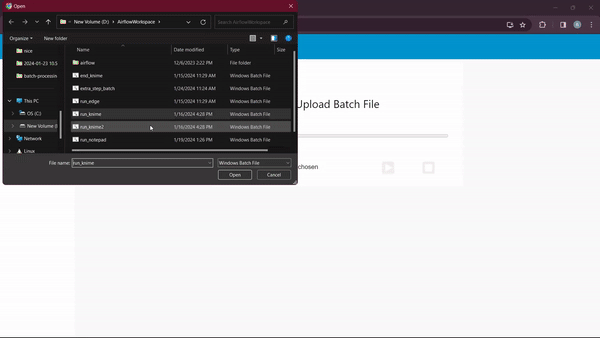

# Batch Processing Scheduler
A batch processing scheduler is a system that automates the execution of batch files. These batch files can be scheduled to run at a specific time.

## Usage Overview
### I - Input Workflow Name and Interval:
1. Start by entering your KNIME workflow name and the interval for scheduling. This information will be automatically saved into the nodes.

### II - Navigate to the Second Tab:
1. Move to the second tab in the interface. Here, you will find two tables:
    - The first table displays all the batch files added.
    - The second table shows batch files that have been selected for scheduling

### III - Select Batch Files for Scheduling:
1. To select batch files for scheduling, simply click on them in the first table.
2. Selected batch files will be displayed in the second table.
3. Once you've chosen the batch files for scheduling, you can start scheduling.

### IV - Initiate Scheduling Process:
1. Once you have chosen the batch files for scheduling, you can uses the Start and Stop buttons in the third group for initiating and ending the scheduling process.